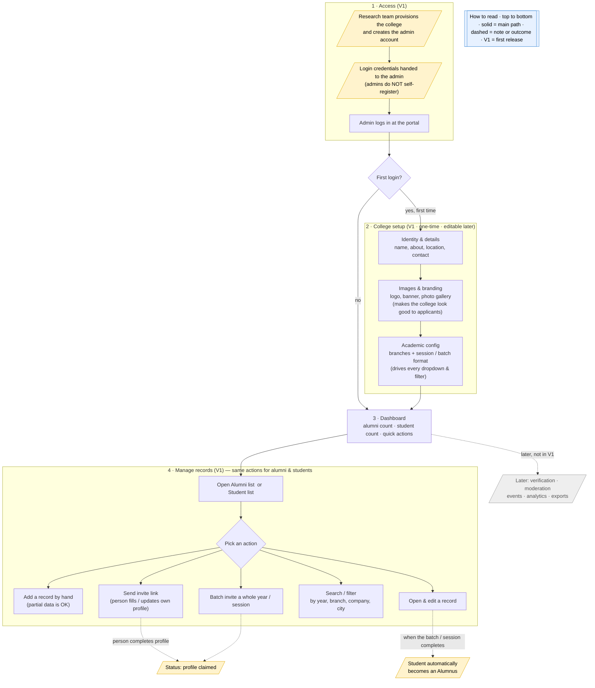

# Admin Portal Flow

> Living document. The admin (college / TPO) is the **primary V1 user** — see [architecture.md](architecture.md). This doc describes what the admin can do and the step-by-step flow through the portal. Each capability is tagged **[V1]** or **[Later]**. `TODO` marks what's still open. Nothing here is final; update as decisions are made.

## Why this doc exists

V1 is anchored on the college (TPO / admin) as the primary user. So the admin portal *is* V1 — the first real surface we ship. This doc is the detailed flow: how the admin gets in, sets up the college, and manages records.

**Current role decision:** the platform has **three roles — student, alumni, and admin**. The **admin** does everything on the admin side: set up the college on the portal, and manage both **student** and **alumni** records. Students and alumni are the people *in* the system; the admin is the one who runs it.

**Two rules carried over from the project:**

- **College-agnostic.** Nothing here is KEC-specific. College name, branches, batches, sessions, logos, and config come from the database / config — never hardcoded. BTKIT / KEC is the first college, not the only one (see multi-tenant note below).
- **Data first.** The admin's first and most important job in V1 is getting clean student and alumni data into the system. Everything else (events, moderation, analytics) grows from there.

## The three roles

| Role | Who they are | What they do |
|---|---|---|
| **Admin** | The college / TPO or a college-appointed person who runs the portal | Sets up the college; manages student and alumni records; invites people; (later) verification, events, moderation |
| **Alumni** | A former student | Maintains their own profile, appears in the directory, gives back |
| **Student** | A current student | Maintains their own profile; automatically becomes an alumnus when their batch / session completes |

> Student and alumni are **roles**, not separate populations — the same person is a student today and an alumnus tomorrow. The admin manages both from one place. This doc covers the **admin** flow only; the student and alumni flows are separate.

---

## The admin flow at a glance

> The diagram below is meant to stand on its own — read it top to bottom and you have the whole admin flow. The sections that follow are reference detail, only needed if you want the specifics of one step.



<details>
<summary>Text version of the same flow</summary>

```
        Login  ──►  College setup ──►  Dashboard
          │          (one-time)          │
          │                              ├─► Manage alumni records         [V1]
          │                              │     add · invite · batch invite
          │                              │     search/filter · edit
          │                              │
          │                              ├─► Manage student records        [V1]
          │                              │     add · invite · batch invite
          │                              │     search/filter · edit
          │                              │
          │                              ├─► Verification & approval        [Later]
          │                              ├─► Moderation                     [Later]
          │                              ├─► Events                         [Later]
          │                              ├─► Insights / analytics           [Later]
          │                              └─► Exports (booklet/CSV)          [Later]
```

</details>

---

## 1. Login / Authentication **[V1]**

The admin logs in and lands in the admin area.

**Flow:**

1. Admin opens the portal URL and logs in with the credentials provided by the research team.
2. **First login** → the admin completes College setup (§2). **Later logins** → straight to the dashboard.

> **Onboarding & credentials — decided.** Colleges are **not** self-registered and admins do **not** sign themselves up. For V1, the research team **provisions each college and creates its admin account**, then hands the login credentials to the admin. Self-service college registration is a later, multi-college concern — out of V1.

> **Note — one login, all roles.** There is a single login surface for everyone (students, alumni, admins); the system routes each account to the right view based on its role. That role-routing is a general auth concern — this doc follows only the admin path, so it isn't drawn in the flow above.

> **TODO — open (feeds the stack decision, see [research.md](research.md) Q11):** Auth method not decided. Candidates:
> - Google SSO (simple, most people have Google accounts).
> - College-email login (e.g. `name@college.edu`).
> - Email + OTP.
>
> Whatever we pick must be configurable per college.

**Security expectations (apply from V1):** admin sessions time out; student and alumni contact data is sensitive and only visible to authorized admins; no admin action on real records without being logged in.

## 2. College setup (one-time, editable later) **[V1]**

The admin sets the college up on the portal — its **full details and images**, not just a name. This is the foundation everything else keys off, so it's a real admin responsibility. Done once at the start, but every field stays editable afterwards.

**Two jobs this setup does:**

1. **Configuration** — the branches, sessions, and identity that drive every dropdown, filter, and the student→alumni transition. *Functional.*
2. **Presentation / marketing** — a complete, good-looking college profile (details + images). A strong visual presence is how the college **markets itself and looks good to prospective students considering admission**. The college caring about its own image is a real V1 motivation (see "market the college" in [architecture.md](architecture.md)), so this isn't decoration — it's part of the value.

### 2a. College identity & details

- **Display name** and **short code** (e.g. for the URL / tenant).
- **Tagline / motto** (optional).
- **About / description** — what the college is, its history, founding year.
- **Location** — address, city, state.
- **Contact** — official email, phone.
- **Website** and **social links** (optional).
- **Accreditation / affiliation** (optional) — e.g. the university it's affiliated to.

### 2b. Images & branding

This is what makes the profile look good. All images are uploads, stored per college.

- **Logo** — used across the portal (header, invites, exports).
- **Cover / banner image** — the hero image on the college's profile.
- **Photo gallery** — campus, buildings, events, labs. The set of images that present the college well to anyone who lands on it.
- **Brand colour(s)** (optional) — so the portal can carry the college's look, not a generic one.

> **TODO — open:** image storage and limits (where files live, max size, allowed formats) — decided with the stack. Keep it simple in V1.

### 2c. Academic configuration

- **Branches / departments** — define the list. Drives every dropdown and filter later, so it is data, not hardcoded.
- **Session / batch format** — how a graduating year / session is labelled (e.g. `2020–2024`). Drives filtering and the student→alumni transition.

**Flow:** fill 2a → upload 2b → configure 2c → save → land on the dashboard. Any of it can be edited later from a **College settings** screen.

> This setup makes the deployment college-agnostic in practice: a different college just fills in different values and uploads its own images here — no code change. Nothing about KEC/BTKIT is hardcoded; it's all entered by the admin.

## 3. Dashboard (home) **[V1]**

The first thing the admin sees after login. In V1 it is intentionally simple — a launch point into the records, not an analytics cockpit.

**V1 dashboard shows:**

- Counts: total alumni records and total student records on file.
- Primary entry points: **Manage alumni**, **Manage students**.
- Quick actions: **Add record**, **Invite**, **Batch invite**.
- (Optional, if cheap) a count of self-created/updated profiles waiting for a look.

**[Later] dashboard adds:** engagement metrics, recent activity, pending verification count, upcoming events — see Insights below.

---

## 4. Manage records — alumni and students **[V1]**

This is the core V1 work. The admin manages **two record sets — alumni and students** — with the **same set of actions**. They replace today's mess: scattered Google Forms, spreadsheets, and data spread across different people.

The actions below apply to **both** alumni and student records (the fields differ slightly; see each sub-section).

### 4a. View the records list

**Flow:**

1. Admin opens **Manage alumni** or **Manage students**.
2. Sees a paginated table of records for this college.
3. Each row shows key fields at a glance plus a status (e.g. *record only* / *invited* / *profile claimed*).
4. From here: search, filter, open a record, edit, or send an invite.

**Alumni row (indicative):** name · graduation year (session) · branch · current company · current role · city · contact-on-file · status.

**Student row (indicative):** name · branch · current year/semester · session · contact-on-file · status.

> **TODO:** exact field set is part of the data-model work (see [architecture.md](architecture.md) → System Design → Data model, and [research.md](research.md) Q10 on a college-agnostic data model).

### 4b. Add a record (manual entry)

Because the TPO holds many records directly (especially recent placements and current students), the admin must be able to add a person by hand without waiting for them to self-register.

**Flow:**

1. From the list, click **Add** (alumnus or student, depending on which list).
2. Fill the form. Required vs. optional is kept lenient — **partial data must be accepted** (a name now, the rest later; the core lesson from the IIT Delhi Yearbook tool — see [reference](../artifacts/reference/alumni-booklet.md)).
3. Save → the record appears in the list with status *record only* (admin-created, not yet claimed by the person).
4. Optionally send that person an invite to claim/complete their own profile (§4c).

**Add-alumnus fields (indicative):** name · graduation year/session · branch · email and/or phone · current company · role · city · LinkedIn (optional).

**Add-student fields (indicative):** name · branch · session · current year/semester · email and/or phone · roll/enrollment number (optional).

**Edge cases V1 must handle gracefully:**

- **Duplicate detection** — warn if a record with the same email/phone/name+batch already exists, so we don't fragment data again. *(TODO: block, warn, or merge?)*
- **Editing later** — every field editable after creation (§4e).

### 4c. Invite a person to create / update their profile

The admin holds the records; the person fills in the detail and keeps it current. The invite link hands them the pen.

**Flow:**

1. From a record (or the Add flow), click **Send invite**.
2. System generates a unique invite link tied to that record (so their submission updates *that* record, not a new duplicate).
3. Link is sent by email and/or shown for the admin to share over any channel.
4. The person opens the link → profile create/update form → submits.
5. Record status moves *invited* → *profile claimed*; the admin sees the updated data.

> **TODO — open:**
> - Link expiry / single-use vs. reusable?
> - Does a claimed profile go live immediately, or wait for admin review? (Ties to verification, **[Later]** §5.)

### 4d. Batch invite — invite a whole group at once

So the admin doesn't send links one by one. Invite an entire batch/session (or year of students) in one action.

**Flow:**

1. Open **Batch invite**.
2. Select a target group — by graduation year, session, and/or branch — or upload a list (CSV) of emails/contacts.
3. System creates a record (if one doesn't exist) and a unique invite link per person.
4. Sends the batch of invites.
5. Admin sees a simple result: sent / failed / already-claimed counts.

> **TODO — open (depends on [research.md](research.md) Q1–6, the TPO data discovery):**
> - What's the source list — TPO records, an Excel/CSV export, current-student emails already being collected (~300 on file up to 2nd year)?
> - Email-sending mechanics (provider, deliverability, rate limits) — decided with the stack.

### 4e. Search, filter & edit a record

**Search / filter:** from a list, search by name / email, or filter by year (session), branch, company, city (alumni) or year/semester (students). The list narrows live. Filters key off the college's own branch/session config — data-driven, not hardcoded.

**Edit a record:** open it → view full profile, status, and how it was created/updated (admin-added vs. self-claimed) → edit any field → save. Also: re-send invite, or (TODO) archive/soft-delete.

> **Note — the student→alumni transition (decided).** A student **automatically becomes an alumnus when their batch / session completes** — there is no manual admin step. The session end configured in College setup (§2c) drives it. This implies **one underlying person record whose role flips on session completion**, with "students" and "alumni" being two views over the same records rather than two separate record sets. **TODO:** confirm the exact trigger when the data model is finalized — session end date alone, or an admin "promote batch" confirmation as a safety check.

---

## Later phases — full admin vision (not V1)

Out of V1, documented so the V1 data model and screens don't paint us into a corner. Order is indicative, not committed.

## 5. Verification & approval **[Later]**

Confirming someone is genuinely an alumnus (or a real current student) — flagged as a major challenge across the early requirement notes ([artifacts/requirement-notes/](../artifacts/requirement-notes/)).

**Indicative flow:** person submits proof (degree certificate, student ID, roll/enrollment number, or LinkedIn) → lands in an **approval queue** → admin approves / rejects / requests more → on approval the profile is marked *verified* (and may get a badge).

> **TODO — open ([research.md](research.md), "Verification"):** What proof do we trust? Document upload, roll-number match against college records, manual call-back, or LinkedIn? Unsolved, high-priority — not a V1 commitment.

## 6. Moderation **[Later]**

Once alumni/students post content (jobs, events, messages), the admin reviews/removes spam or inappropriate content and handles reports. Out of scope until there's user-generated content.

## 7. Events **[Later]**

Admin creates event pages (reunions, webinars, talks, workshops), manages registrations, and communicates details — replacing event info getting buried in WhatsApp. (See use-case rationale in [research.md](research.md).)

## 8. Insights / analytics **[Later]**

Dashboards on alumni distribution (by company, city, domain, batch), engagement, and program ROI — what lets the college *market* itself and measure alumni relations. Builds on the centralized data V1 collects.

## 9. Exports — booklet & data **[Later]**

- **CSV / data export** of the records (likely cheap, possibly bumped earlier).
- **Yearbook / booklet export** — generate a printable alumni booklet, the IIT Delhi use case. ColoredCow's tool *did not* auto-generate the book; layout was manual. Auto-layout would be new ground (see [reference](../artifacts/reference/alumni-booklet.md)).

---

## Multi-tenant note (applies throughout)

Every admin action is **scoped to one college**. The direction (see [architecture.md](architecture.md)): same codebase, **separate database per college**; college name, logos, branding, branches, and session format come from the database / config (set by the admin in §2). An admin for College A never sees College B's data. V1 ships for one college, but no screen or query may assume there's only ever one.

## Where AI fits (early ideas, not commitments)

Tagged **[Later]** unless noted. From [research.md](research.md):

- **Profile completion help** — suggest fields / clean up entries during manual add or claim. *(Could be a small, early win.)*
- **Duplicate / merge suggestions** — AI-assisted matching when the admin adds a record that may already exist.
- **Auto-categorization** — tag alumni by domain/role from LinkedIn-style data, powering the directory and insights.
- **Smart search** — natural-language filtering of a records list.

## Open questions this flow depends on

These live in [research.md](research.md) — listed here so the dependency is explicit. The flow above can't be finalized until they're answered:

1. Where does the first student/alumni data actually come from? (TPO records / Excel / current-student emails / self-upload) — **Investigating** (TPO visit).
2. What data does the TPO already hold, in what format, and will they share it? — **Investigating**.
3. Authentication method — Google SSO vs. college email vs. OTP — **Open**.
4. Verification approach — **Open**.
5. The college-agnostic data model (which fields, what's required) — **Open**. _(The student→alumni transition itself is decided: automatic on batch/session completion — see §4e.)_

> When any of these is answered, update the relevant section above and remove its `TODO`.
